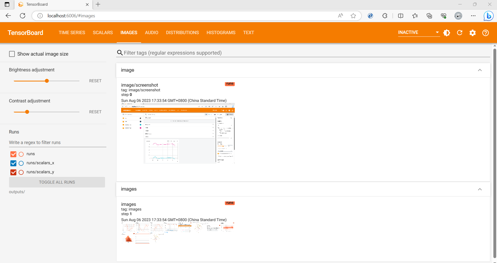

# tensorboard.cpp
A C++ library for TensorBoard. The library provides APIs to write TensorBoard events.

The current release is tested on CentOS, Ubuntu and WSL, with TensorBoard 2.13.0.
 * Support `scalar`, `histogram`, `histogram_raw`, `image`, `images`, `audio`, `text` and `projector` summaries.

## Getting Started

You can write events by `AddXXX` function calls like in Python, e.g.,

```C++
#include "record/recorder.h"

int main(int argc, char* argv[]) {
  // Initialize TensorBoard recoder
  nlptk::Recorder recorder();

  // add text
  recorder.AddText("text", "text message", 0);

  // add scalar
  for (int i = 0; i < 1000; ++i) {
    recorder.AddScalar("scalar", 0.01 * i, i);
  }

  // ...
  return 0;
}

```

## Building from Source 

Current, TensorBoard.cpp supports `Bazel` only for compiling the project from source. Other build systems like CMake may be supported later.

### Bazel

To use TensorBoard.cpp within a project which used the [Bazel](https://bazel.build) build tool, add the following lines to you `WORKSPACE` file:

```starlark
load("@bazel_tools//tools/build_defs/repo:git.bzl", "new_git_repository")
load("@bazel_tools//tools/build_defs/repo:http.bzl", "http_archive")

git_repository(
  name = "tensorboard_cpp",
  remote = "https://github.com/Mininglamp-Technology/tensorboard.cpp.git",
)

http_archive(
  name = "glog",
  sha256 = "8a83bf982f37bb70825df71a9709fa90ea9f4447fb3c099e1d720a439d88bad6",
  strip_prefix = "glog-0.6.0",
  urls = [
    "https://github.com/google/glog/archive/v0.6.0.tar.gz"
  ],
)

new_git_repository(
  name = "stb",
  remote = "https://github.com/nothings/stb.git",
  commit = "5736b15f7ea0ffb08dd38af21067c314d6a3aae9",
  shallow_since = "1675018027 -0800",
  build_file = "//third_party/stb:BUILD.bazel",
)

http_archive(
  name = "com_google_protobuf",
  sha256 = "c29d8b4b79389463c546f98b15aa4391d4ed7ec459340c47bffe15db63eb9126",
  strip_prefix = "protobuf-3.21.3",
  urls = [
    "https://github.com/protocolbuffers/protobuf/archive/v3.21.3.tar.gz"
  ],
)

load("@com_google_protobuf//:protobuf_deps.bzl", "protobuf_deps")
protobuf_deps()
```

You can the add `@tensorboard_cpp//record:record` to the deps section of a `cc_binary` or `cc_library` rule, and `#include <record/recorder.h>` to include it in your source code. Here's a simple example:

```starlark
cc_binary(
  name = "mainrun",
  srcs = [
    "main.cc",
  ],
  deps = [
    "@tensorboard_cpp//record:record",
  ],
)
```

### Examples

Examples could be found in [examples](examples). The `example1` use default file writer to record. The `example2` use sync file writer to record.

* Clone TensorBoard.cpp project 
```shell
$ git clone https://github.com/Mininglamp-Technology/tensorboard.cpp.git
```

* Compile the example1 with `Bazel`, which could be installed follow instructions [here](http://bazel.build/docs/install.html). 
```shell
$ cd tensorboard.cpp
$ bazel build examples:example1
```

* Run example and rendering:
```shell
$ bazel-bin/examples/example1
$ tensorboard --logdir runs
```

## Screenshots

* Time Series


* Scalars


* Images


* Audio


* Distributions


* Histograms


* Text


* Projector


## Reference

* [tensorflow/tensorboard](https://github.com/tensorflow/tensorboard)
* [dmlc/tensorboard](https://github.com/dmlc/tensorboard)
